# Dotted Font Generator  

**P5.js** est une librairie javascript conçu pour ce qu'on appelle le creave coding. Un peu comme director, la librairie ulise une métaphore pour son langage, celle du dessin car les fichiers javascript sont nommés "sketch", champ lexical hérité directement de Processing.

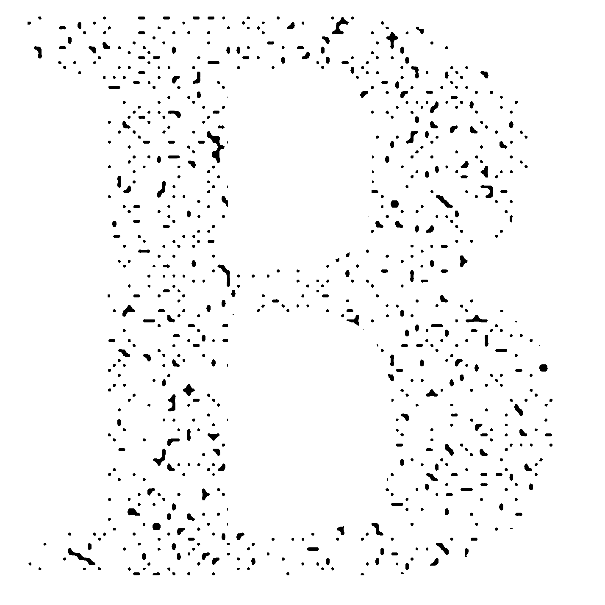

Une première idée est de passer du bruit d'une quelconque manière en noir et blanc, sans nuances de gris, sur une lettre comme le B ci-dessus. Mais le test présente des problèmes de densité dans certaines zones, peu obtimal pour le rendu que nous souhaitons avoir.


Une seconde idée est de grillager des lettres noires, sur un fond blanc avec une grille paramétrable, et blanche. L'épaisseur des traits et leur espacement derterminent le nombre de points et leur taille. Ci-dessous sont présents 3 séries d'images directement générer par le script détaillant des étapes de travaille.  


Et une utilisation adapté de fonctions P5.js et native à javascript permet d'obtenir des dossiers remplis d'images de ces fonts en pointillés.
  

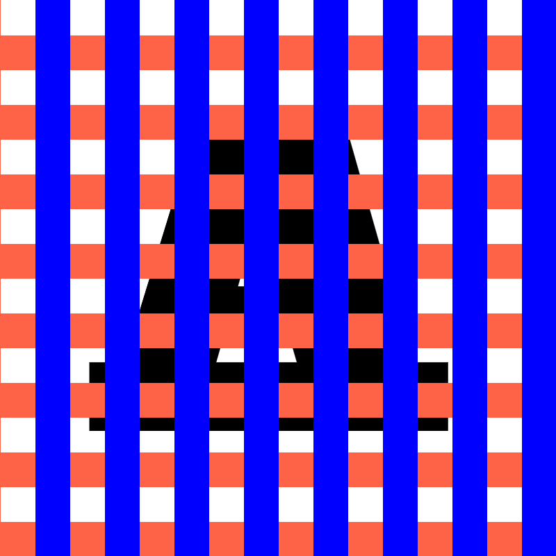
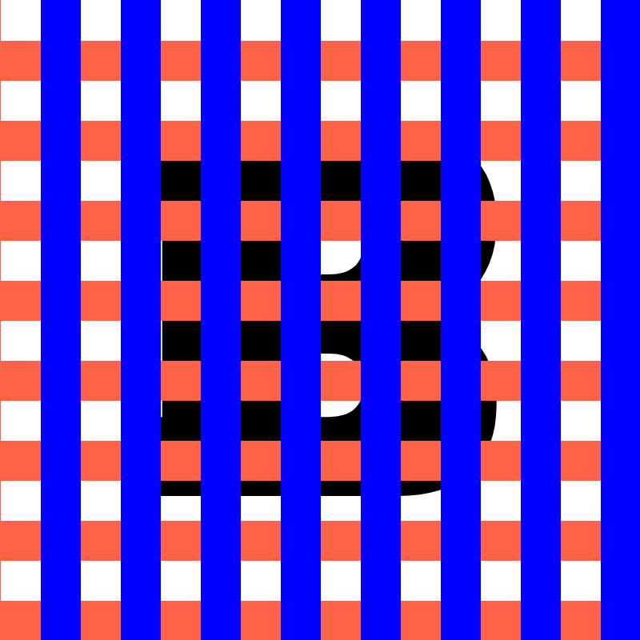
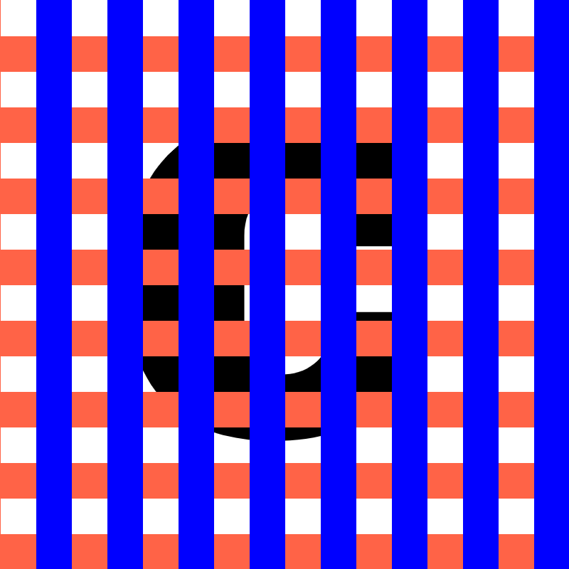
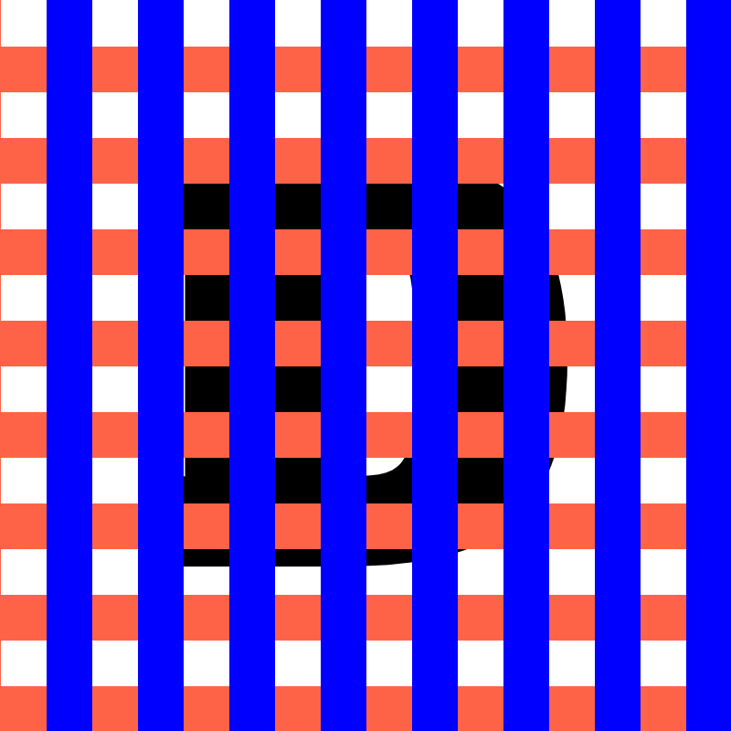
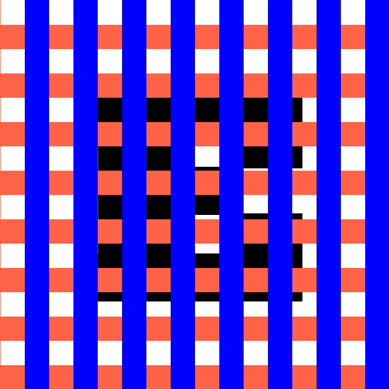  
Grille aux traits larges et espacés, avec une couleur unique pour les lignes
horizontales et vercales.  
<br>  
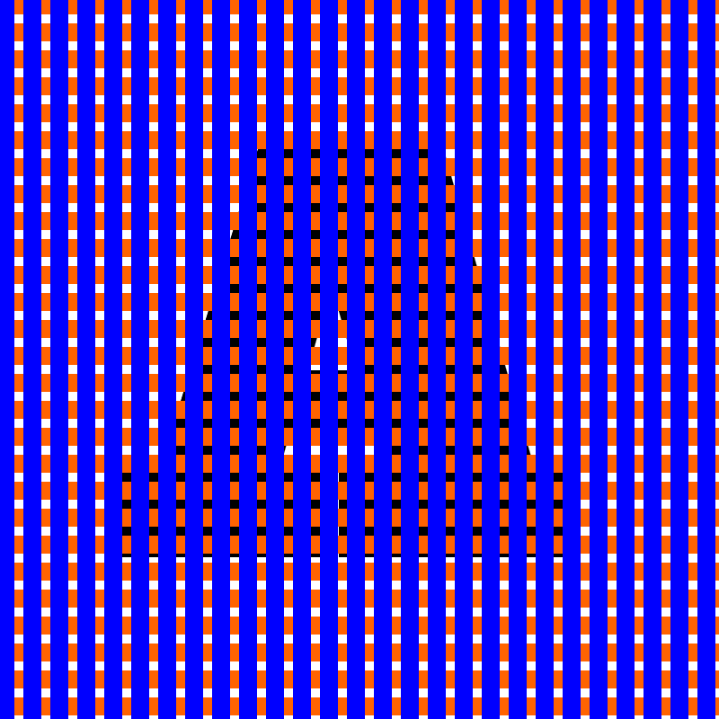
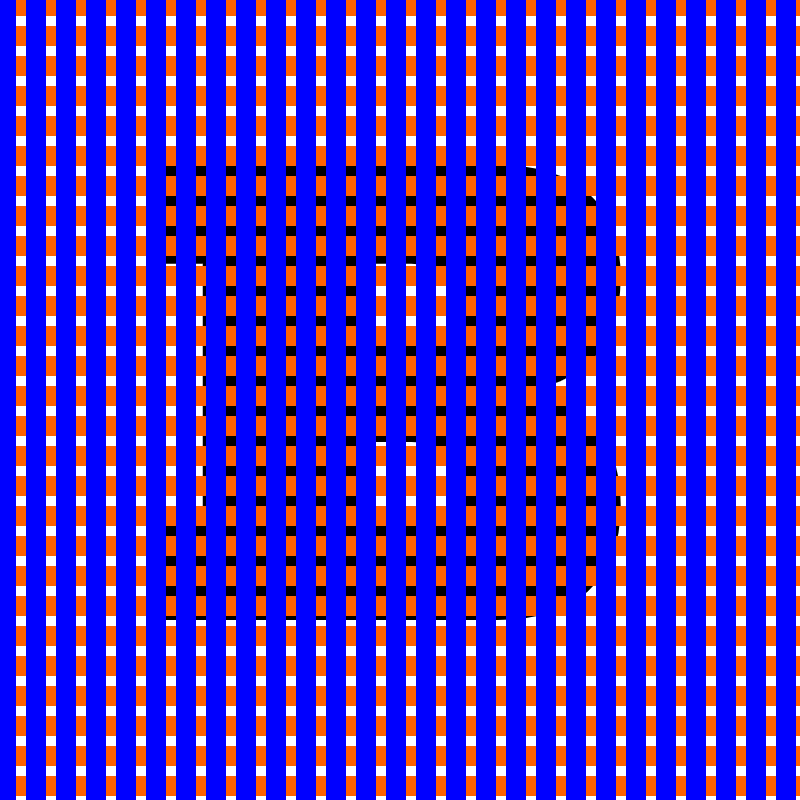
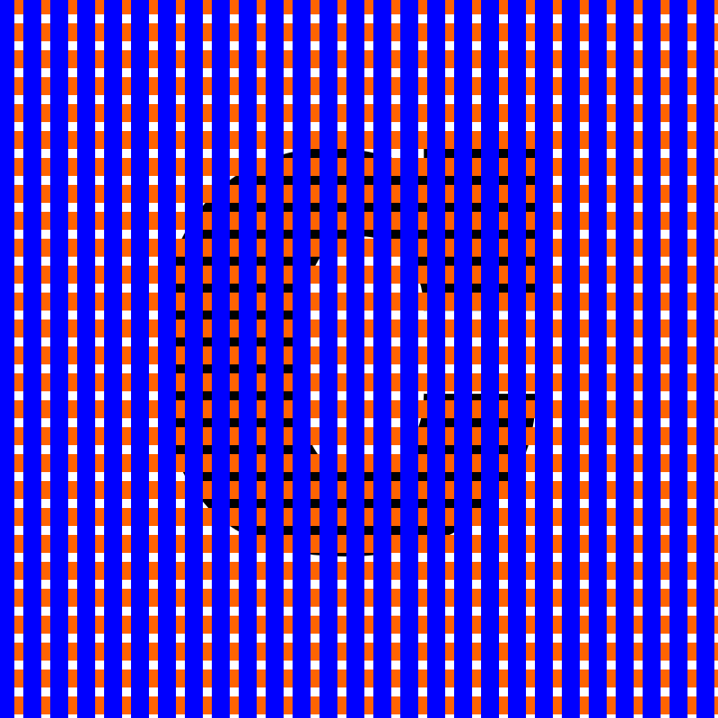
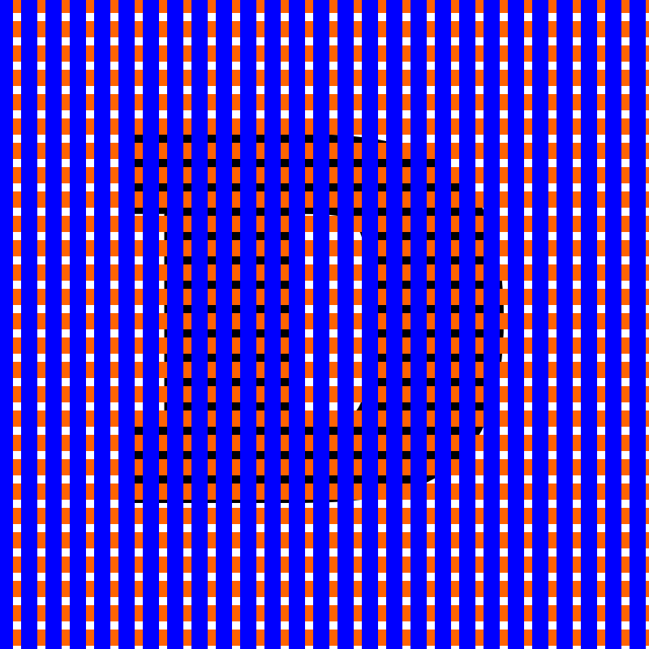
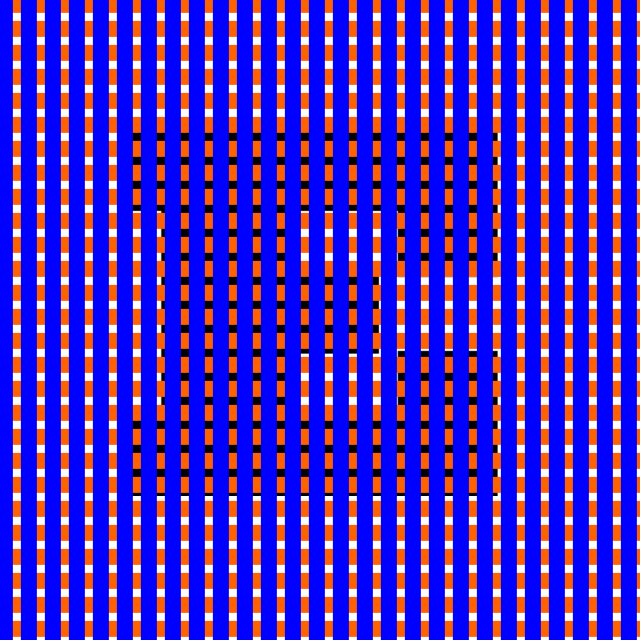  
Grille aux traits fins et proches, mêmes couleurs qu'au-dessus.
<br>  


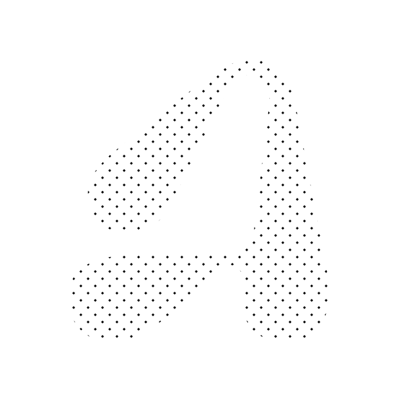
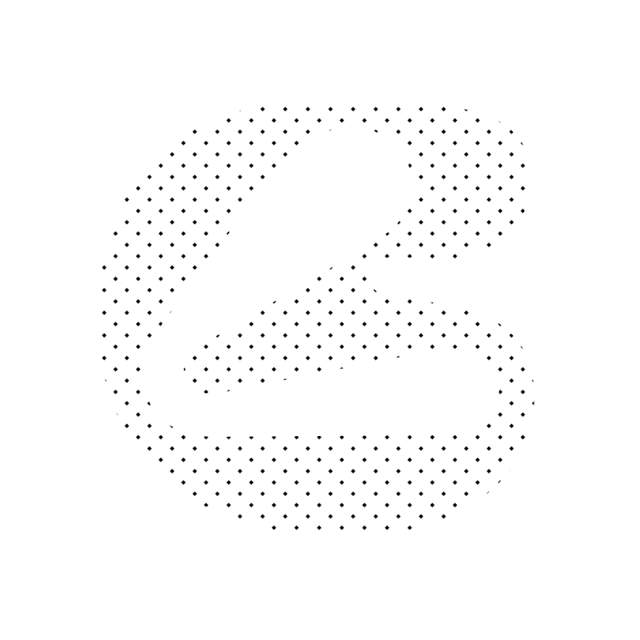
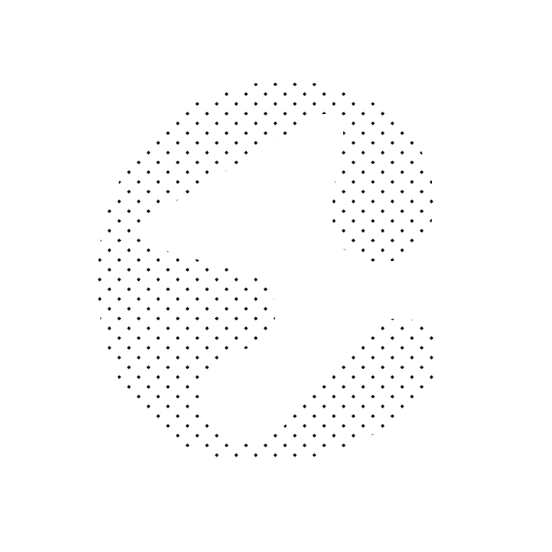
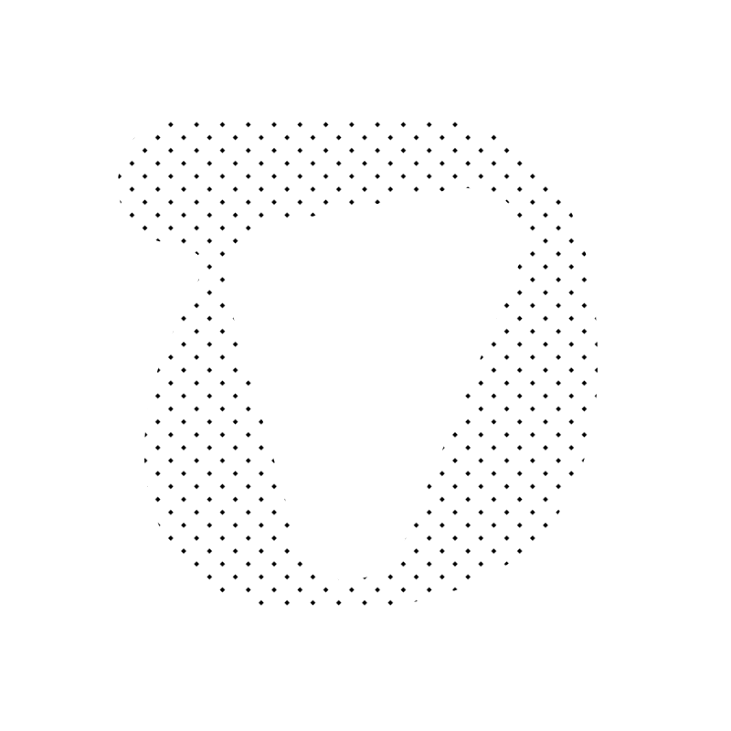
  

Résultat avec une grille blanche et les mêmes épaisseurs que sur la seconde
série.

```js
function setup() {
  cnv = createCanvas(canvasW, canvasH);
  textFont(Amdal);
  
  colorA = color("white")
  colorB = color("white")

  let size = 7;
  let space = 4;
  
  grid2 = new Grid2(size, space, size, space, colorA, colorB);
  txt1 = new Texte();
}

function draw() {
  background(255, 255, 255, 255);

  frameRate(FPS)

  if (globalGlyphIndex >= 30) {
    globalGlyphIndex = 0;
    savingImgs = false;
    FPS = 1.5;
  }

  txt1.show(globalGlyphIndex);

  grid2.show();

  globalGlyphIndex++;
  if (savingImgs) {
    saveImgToPage(cnv.canvas)
  }
}
```


