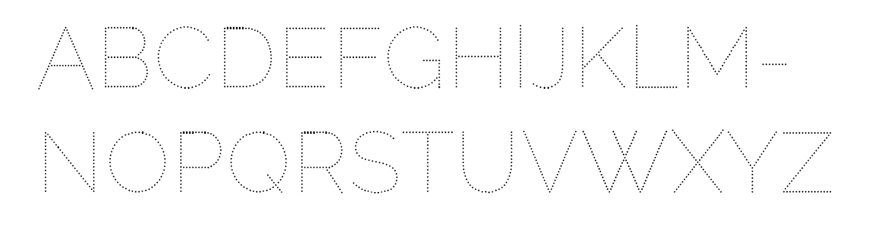
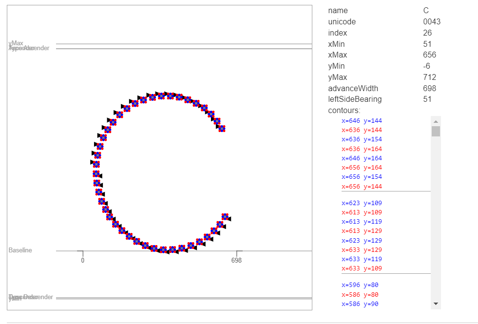
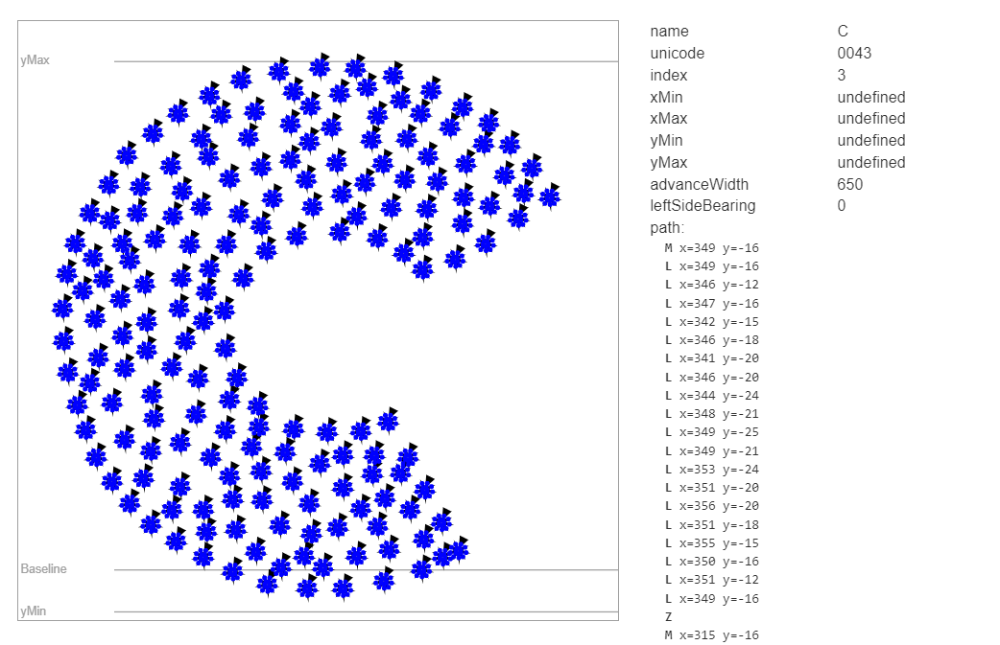
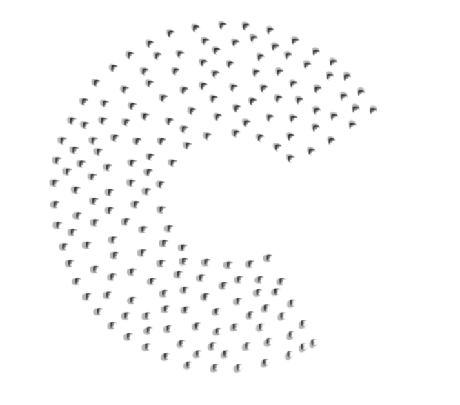

###Utiliser Opentype.js pour créer un fichier de font en partant d’un fichier json.

Prérequis : 
Comme précisier à la fin du livret «Reprogrammer : lettre S», nous obtenons un fichier json contenant les 26 lots de 180 paires de coordonnées x et y de points dessinants des lettres.

Donc avec 180 points d’un même lot, nous avons un Glyph, de A à Z.

Il existe déjà des fonts dont le dessin pourrait être qualifié d’être en pointillé, je prendrai comme exemple la Raleway Dots disponible gratuitement en ligne.



Ce fichier de font va nous permettre d’étudier un cas similaire à ce que nous voulons créer pour identifier les étapes nécessaires à l’existance d’un tel objet.

Opentype.js présente un site web à l’addresse : https://opentype.js.org/. Ce site permet de visualiser des fichiers de font en utilisant la librairie Opentype.js et faire apparaitre des éléments tel que les points d’ancrage, les poignées, mais aussi des informations spécifiques aux glyphes tel que le nom du caractère, son unicode, et ce qui nous intéresse particulièrement, son path et ses contours.



Voici les informations que le site peut nous donner sur le caractère C de la Raleway Dots.
Ce qui nous intéresse particulièrement, c’est cette série de «contours», où chaque contour est un point, ici le dessin d’un cercle avec en bleu les coordonnées des points d’ancrage de ce cercle, et en rouge les poignées de ces points d’ancrage, et la flèche noire donnant la direction du tracée. 

Nous disposons donc d’un tableau à 3 dimensions comme ce-ci :
[glyph][point][coordonée x ou y]

Dans la fonction suivante, pour chaque glyph (1er boucle for), nous créons un nouveau élément opentype.Path(), pour dessiner une forme (ici une étoile) pour chaque point (2e boucle for) nous bougeons un crayon virtuel sur les coordonsées du point, et nous suivons les coordonnées stocké dans la variable basicShape (3e boucle for), les coordonnées du dernier point d’ancrage du dessin étant identique au premier.

Une fois le dessin fait pour les 180 points d’un glyph, nous créons un nouvel objet opentype.Glyph(), qui prend comme valeur à sa propriété path le tracé qui vient d’être dessiné.
Ce nouveau Glypth en enfin pousser dans un tableau pour les stocker petit à petit.

```js
function pathDataset1() {
    for (let j = 0; j < data_set1.length; j++) {
        let newAbcPath = new opentype.Path();

        for (let i = 0; i < data_set1[j].length; i++) {
            newAbcPath.moveTo(basicShape[0][0] + data_set1[j][i][0], basicShape[0][1] + (data_set1[j][i][1] * (-1) + 500))

            for (let k = 0; k < basicShape.length; k++) {
                newAbcPath.lineTo(basicShape[k][0] + data_set1[j][i][0], basicShape[k][1] + (data_set1[j][i][1] * (-1) + 500))

            }

        }
        let newGlyph = new opentype.Glyph({
            name: abc[j],
            unicode: 65 + j,
            advanceWidth: 650,
            path: newAbcPath,
        })
        data1Glyphs.push(newGlyph);
    }
    drawFont()
}
```

Ce qui nous permet dans une fonction drawFont() de récupérer ces glyphs, et les injecter en tant que valeur pour la propriété glyphs d’un nouvel objet opentype.Font(), que nous pouvons 
télécharger simplement comme démontrer sur la ligne 42.


```js
function drawFont() {
    data1Glyphs.splice(0, 0, notdefGlyph);
    
    const font_data1 = new opentype.Font({
        familyName: 'Re-Alphabet',
        styleName: 'Medium',
        unitsPerEm: 800,
        ascender: 800,
        descender: -200,
        glyphs: data1Glyphs
    })
    
    font_data1.download();
}
```

Voici un screenshot du C tiré du fichier obtenu grâce que script détailé avant.


Et voici un screenshot du C tiré du programme CD-Rom «Alphabet», lui même tiré du livre du même nom par Kveta Pacovska.
