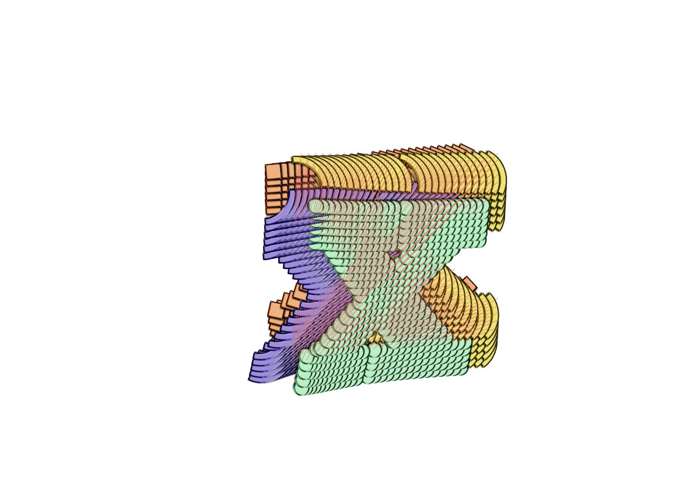

Écrire, ça prend du temps et de l'espace, et même si l'autocomplétion nous permets déjà un gains de temps conséquents, parfois faire ses propres raccourcis s'avère utile, c'est pour ça que je décide à chaque début de mes projets de déclarer ces 2 constantes, qui me permettent une lecture plus clair et une écriture légèrement plus rapide.
```js
const WiW = window.innerWidth, WiH = window.innerHeight;
```


### Plugin matter.js
La ligne de code suivante est en grande partie responsable de la capacité à attirer les particules au curseur. C'est un appel à un plugin ayant pour principe de désigner une particule comme "attracteur", une particule qui attirera toutes les autres.
```js
Matter.use(MatterAttractors);
```

### Mise en route  

Dans cette partie, j'opère une méthode qui m'a permis de laisser ***p5.js*** gérer la création du canvas dans le DOM avec la fonction intégrer createCanvas(), puis de recupérer cette élement du DOM et son context avec la méthode ```jsdocument.querySelector``` pour enfin dire à matter.js qu'il doit utiliser ces éléments là pour appliquer son rendu. En d'autres termes, c'est un petit bidouillage qui permets aux 2 librairies de se partager un seul support de rendu graphique, et donc faire fonctionner ultérieurement le plugin très important qu'est P5.capture, tout en gardant l'accès au propriété de rendu qu'offre matter.js comme l'utilisation de sprites.
```js
let engine, world;

function setup() {
    createCanvas(w, h, P2D)

    let newCnv = document.querySelector("canvas");
    let newCxt = document.querySelector("canvas").getContext('2d');

    engine = Engine.create(), world = engine.world;
    render = Render.create({
        engine: engine,
        canvas: newCnv,
        context: newCxt,
        // setPixelRatio: 10,
        options: {
            width: WiW,
            height: WiH,
            showAngleIndicator: false,
            wireframes: false,
            background: 'rgba(0,0,0,0)',
            pixelRatio: 1,
        }
    });
    
    Render.run(render);

    loadScripts()
}
```


Ensuite, ajouter les scripts qui gère les sets de données avec classes.js et script.js qui gère la création des objets visibles et la gestion des **inputs par l'interface html**.
```js
const listScripts = ["./js/script.js", "./js/classes.js"]
function loadScripts() {
    for (const elem of listScripts) {
        let newScript = document.createElement("script")
        newScript.src = elem;
        document.body.appendChild(newScript)
    }
}
```

### classes.js
```js
class DataSet {
    constructor(name, jsondata, offsetX, offsetY) {
        this.name = name;
        this.jsondata = jsondata;
        this.offsetX = offsetX;
        this.offsetY = offsetY;
    }
}

const ListNameFonts = ['Alphabet', 'Raleway Dots', 'Default P5 font', 'Egyptienne Large', 'Garamond Italic', 'PeaceSans', 'Pilow', 'Typefesse', 'Mainz', "Phrase", "article", "Amdal"];

loadDataSets();
function loadDataSets() {
    let url = './data/json_data_' + (1 + dataSetIndex) + '.json';
    if (dataSetIndex < nbrDataSets) { 
        fetch(url)
            .then(response => response.json())
            .then(jsondata => {
                ListDataSets.push(new DataSet(ListNameFonts[dataSetIndex], jsondata, ListOffsetX[dataSetIndex], ListOffsetY[dataSetIndex]))
                dataSetIndex++;
                loadDataSets();
            });
    } else {
        showLetter('start');
    }
}
```


### Inputs  
Passons à la manipulation. Ce block "animation mode" nous donne 4 choix de mouvements pour la praticule "attractrice", 3 automatiques (la particule décrit un mouvement en cercle, en S, ou en carré/quadrilatère) et 1 intéractif. 


Filtrer l'aperçue. 


## P5.capture

[--> lien vers le repo github <--](https://github.com/tapioca24/p5.capture "lien vers le repo github")


  

Séries de fichiers .jpg générer par le plugin. 